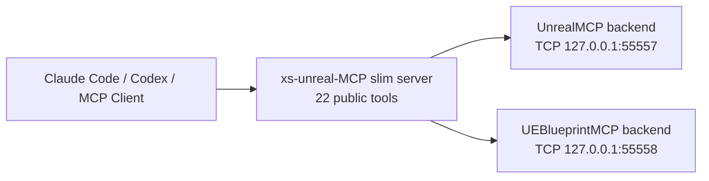

# xs-unreal-MCP

`xs-unreal-MCP` is a slim MCP facade for Unreal Editor TCP backends. It reduces
the client-visible tool surface to 22 commonly used Blueprint and level-editing
tools while forwarding the real work to backend plugins running inside Unreal
Editor.

The repository is designed for public sharing:

- It includes an original Python MCP server.
- It includes an incremental patch for backend graph lookup support.
- It does not include Unreal backend plugin source, binaries, `.uasset` files,
  or project-specific game content.

## Architecture



The two backend families commonly use different wire formats:

| Backend | Default port | Default protocol |
| --- | --- | --- |
| UnrealMCP | `55557` | Raw UTF-8 JSON request; raw JSON response; one request per connection. |
| UEBlueprintMCP | `55558` | 4-byte big-endian length prefix followed by UTF-8 JSON; persistent connection. |

The logical command shape is the same:

```json
{"type":"compile_blueprint","params":{"blueprint_name":"BP_Example"}}
```

## Tool Surface

Slim profile exposes exactly these 22 tools:

`find_nodes`, `get_pins`, `add_node`, `connect`, `disconnect`, `delete_node`,
`set_pin`, `replace_node`, `get_metadata`, `get_variable_info`, `add_variable`,
`add_component`, `compile`, `set_parent_class`, `add_interface`, `spawn_actor`,
`delete_actor`, `get_level`, `set_actor_property`, `set_actor_transform`,
`auto_arrange`, `cleanup_graph`.

`add_node` consolidates common node-creation tools behind one `node_type`
argument, and `set_pin` consolidates literal/default pin setting.

## Quick Start

1. Install compatible Unreal MCP backend plugins in your Unreal project.
2. Apply `patches/macrographs-composite-support.patch` inside the
   `UEBlueprintMCP` plugin directory if you need Macro and collapsed graph name
   lookup.
3. Install this server:

```powershell
cd D:/xs-unreal-MCP/server
uv sync
uv run xs-unreal-mcp
```

4. Add `.mcp.json.example` to your MCP client config and adjust paths/ports.
5. Start Unreal Editor with both backend plugins enabled.
6. Run the slim tool contract check:

```powershell
cd D:/xs-unreal-MCP
uv --directory server run python ../scripts/check_slim_tools.py
```

Expected output starts with:

```text
tool_count=22
```

## Token Reduction Estimate

The slim profile exposes 22 tools instead of a typical combined 100+ tool
surface from multiple Unreal MCP namespaces. In practice, this should reduce
per-turn tool schema injection to roughly one quarter to one fifth of the
combined setup, depending on the MCP client and schema serialization.

Use your client logs or token-counting tooling to measure exact savings in your
environment.

## Environment Variables

| Variable | Default | Purpose |
| --- | --- | --- |
| `XS_MCP_PROFILE` | `slim` | `slim` exposes 22 tools. `full` adds a `raw_command` escape hatch. |
| `XS_MCP_HOST` | `127.0.0.1` | Backend host. |
| `XS_MCP_UNREAL_PORT` | `55557` | Editor/asset backend port. |
| `XS_MCP_BLUEPRINT_PORT` | `55558` | Blueprint graph backend port. |
| `XS_MCP_GRAPH_PORT` | `55557` | Graph-manipulation backend port. |
| `XS_MCP_UNREAL_PROTOCOL` | `raw` | Wire protocol for the UnrealMCP port. |
| `XS_MCP_BLUEPRINT_PROTOCOL` | `length` | Wire protocol for the UEBlueprintMCP port. |
| `XS_MCP_GRAPH_PROTOCOL` | `raw` | Optional graph backend protocol override. |
| `XS_MCP_TIMEOUT` | `30` | Socket timeout in seconds. |
| `XS_MCP_RETRIES` | `1` | Transport retry count after reconnect. |

## Public Package Audit

Before publishing:

```powershell
cd D:/xs-unreal-MCP
python scripts/audit_public_package.py
```

The audit checks for Unreal assets, generated Unreal folders, and known private
local project strings.
